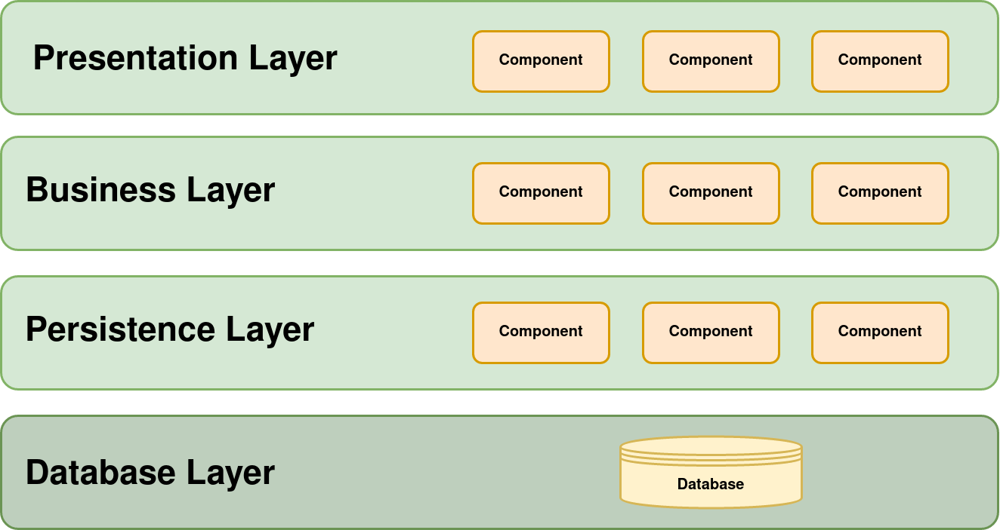
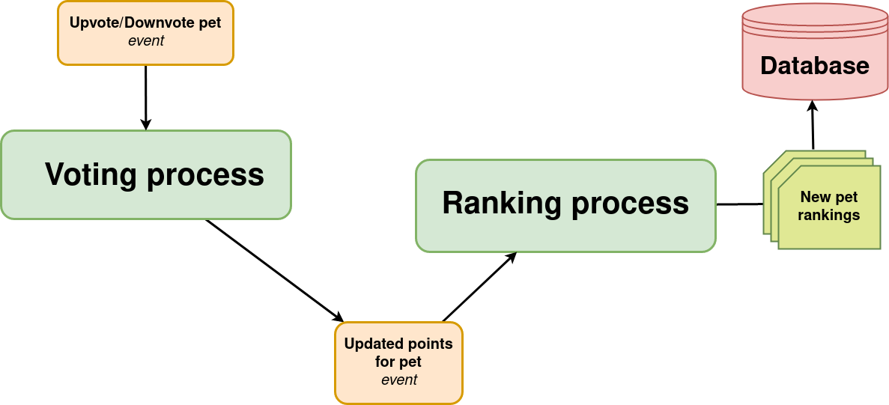
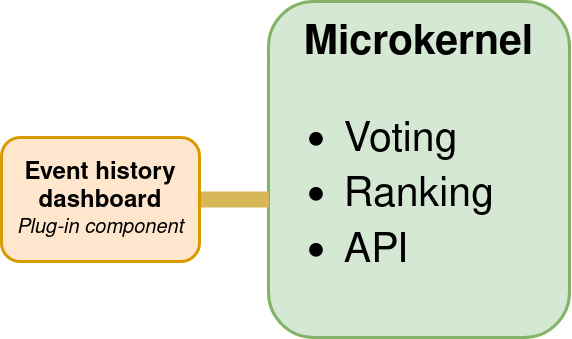
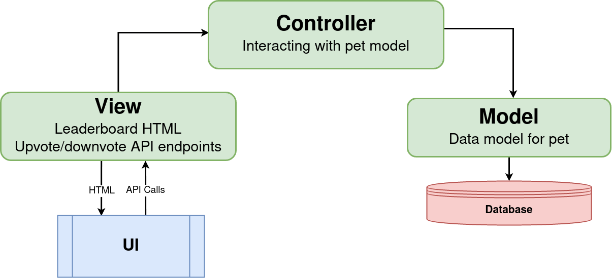

<h1 align="center">Same App Different Design Patterns</h1>

<p align="center">Read the blog post <a href="https://carltheperson.com/posts/same-app-different-design-patterns/">here</a></p>

# The App

Pet cuteness ranker. Upload a picture of your pet and have strangers give it cuteness points. See a global leaderboard where all pets are ranked based on the total cuteness points.


# Running the app

Do these steps after cloning this repository

**1. Install Docker**

[Download Docker](https://docs.docker.com/get-docker/)

**2. Install Node**

[Download NodeJS](https://nodejs.org/en/download/)

**3. Go to the version you want to run**

```bash
cd version-name
```

**3. Install dependencies**

```bash
npm install
```

**4. Run the app**

```bash
npm start
```

You should now be able to go to [localhost:3000](localhost:3000) and see the app

# Design Patterns

## [Layered Architecture](layered-architecture)



## [Event-Driven Architecture](event-driven-architecture)



## [Microkernel Architecture](microkernel-architecture)



## [MVC Architecture](mvc-architecture)



# License

This project is licensed under the MIT License - see the [LICENSE](LICENSE) file for details
