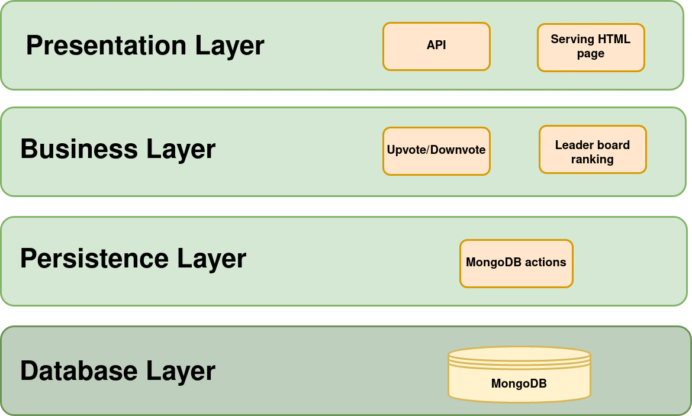

<h1 align="center">Same App Different Design Patterns</h1>

# The App

Pet cuteness ranker. Upload a picture of your pet and have strangers give it cuteness points. See a global leaderboard where all pets are ranked based on the total cuteness points.

# Design Patterns

## [Layered Architecture](https://www.oreilly.com/library/view/software-architecture-patterns/9781491971437/ch01.html)

    

    <em>Inspired by <a src="https://www.oreilly.com/library/view/software-architecture-patterns/9781491971437/ch01.html">Figure 1-1 from Software Architecture Patterns by Mark Richards published by O'Reilly®</a>
		</em>

